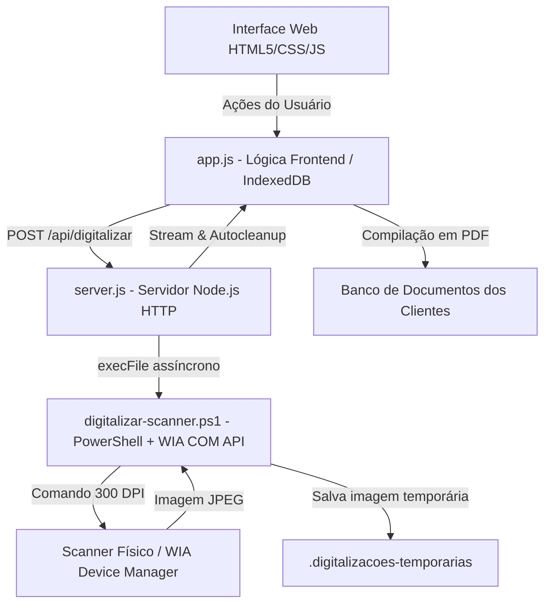

# ⚖️ Sistema de Gestão de Arquivo Jurídico & Digitalização Contínua

> **Aplicação Web/Desktop corporativa desenvolvida para gestão documental, organização automatizada de acervos jurídicos por cliente e integração direta com scanners via automação PowerShell WIA.**


---

## 📌 Visão Geral do Projeto

Este sistema foi projetado para resolver um problema real em ambientes jurídicos e corporativos: a **digitalização massiva, classificação e armazenamento organizado de documentos físicos de clientes**.

A solução elimina a necessidade de softwares proprietários de scanner pagos, permitindo que a aplicação web se comunique diretamente com scanners físicos conectados ao Windows (300 DPI), compilando múltiplas páginas em arquivos PDF únicos categorizados por tipo de documento.

---

## 🔥 Principais Funcionalidades

- 📁 **Organização Automatizada de Pastas por Cliente:** Criação e manutenção de estruturas de diretórios padronizadas (Documentos Pessoais, Médicos, Rurais, Contratos, etc.).
- 🖨️ **Digitalização Direta via Hardware (300 DPI):** Integração assíncrona entre o Node.js e a API WIA (Windows Image Acquisition) através de scripts PowerShell.
- 📄 **Compilação e Divisão de PDFs (jsPDF):** Suporte a digitalização contínua multi-folhas compiladas em um único PDF, com controle automatizado de tamanho máximo por arquivo (split inteligente).
- 📥 **Importação Massiva via CSV:** Cadastro em lote de clientes a partir de planilhas.
- 💾 **Persistência Híbrida & Privacidade:** Armazenamento seguro de dados locais utilizando `IndexedDB` no navegador e sistema de arquivos nativo do sistema operacional (offline-first).

---

## 🏗️ Arquitetura do Sistema



---

## 🎯 Destaques Técnicos para Entrevistas de Emprego / Trainee

Quando for apresentar este projeto em seleções técnicas ou entrevistas de programa Trainee, você pode destacar:

1. **Integração Backend-Hardware (Node.js + PowerShell):** Explique como utilizou o módulo `child_process.execFile` para integrar uma aplicação Node.js leve com objetos COM de baixo nível do Windows (WIA DeviceManager).
2. **Arquitetura Offline-First & Privacidade:** O projeto mantém os dados 100% locais no computador do cliente, eliminando riscos de vazamento de dados sensíveis na nuvem (aderência à LGPD).
3. **Gestão de Recursos e Limpeza Automática:** Demonstre como o servidor Node.js cria streams de leitura (`fs.createReadStream`) e remove os arquivos temporários imediatamente após a transferência (`stream.on('close')`), evitando acúmulo de lixo em disco.

---

## 🚀 Como Executar o Projeto

### Pré-requisitos
- **Sistema Operacional:** Windows 10 ou 11 (para integração com WIA Scanner).
- **Node.js:** Versão 14 ou superior instalada.

### Passo a Passo

1. **Clonar o Repositório:**
   ```bash
   git clone https://github.com/GustavoFragoso/Gestao-Arquivo-Juridico.git
   cd Gestao-Arquivo-Juridico
   ```

2. **Iniciar o Servidor:**
   Dê dois cliques no arquivo `INICIAR ARQUIVO JURIDICO.bat` ou execute no terminal:
   ```bash
   node server.js
   ```

3. **Acessar a Aplicação:**
   Abra seu navegador em: `http://localhost:3000`
